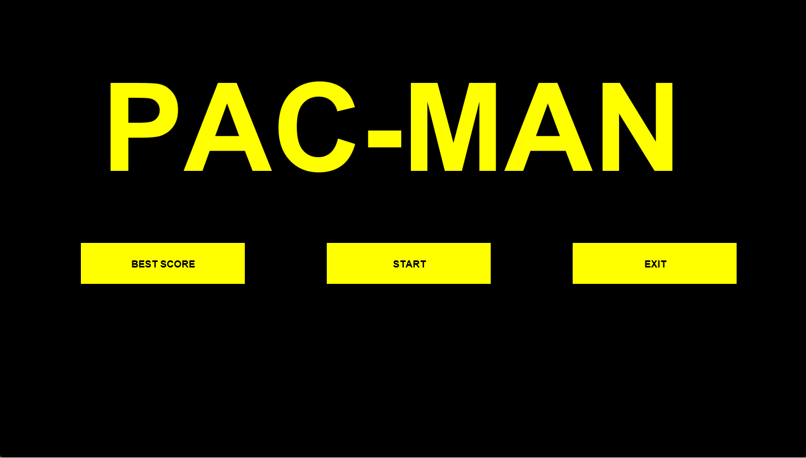

# 👻 Java Pac-Man Game

A classic arcade Pac-Man clone built from scratch using **Java Swing** and **AWT**.

## ✨ Features
* **5 Map Sizes:** Choose your difficulty with XS, S, M, L, or XL maps.
* **Ghost AI:** 4 independent ghosts with unpredictable movement patterns.
* **Advanced Collision System:** Bulletproof collision detection (fixed tunneling/swap bug).
* **High Scores:** Local leaderboard system saving top scores and times for each map.
* **Retro UI:** Custom-styled Java Swing components with a classic black-and-neon aesthetic.

## 🚀 How to Run

### Prerequisites
* **Java** (JDK/JRE) installed on your system.

### Quick Start (Windows)
1. Clone or download this repository.
2. Ensure the project is compiled (the `out/` folder must be generated by your IDE).
3. Double-click the **`start.bat`** file to launch the game instantly.
4. Select a map, click "START", and use your keyboard arrows to play!

---
*Built for fun and learning Java GUI & multithreading!*
